# Progetto Programmazione ad Oggetti: Health_Bot


## Indice

- [Introduzione](#introduzione)

- [Logica di funzionamento](#logica-di-funzionamento)

- [Configurazione iniziale](#configurazione-iniziale)

- [Anteprima: funzionamento nell'app mobile Telegram](#anteprima--funzionamento-nell-app-mobile-telegram)

  * [Registrazione dell'utente:](#registrazione-dell-utente-)
  * [Menù parte 1:](#men--parte-1-)
  * [Menù parte 2:](#men--parte-2-)

- [Download](#download)

- [Rotte](#rotte)

- [Filtri](#filtri)

- [Diagrammi UML](#diagrammi-uml)

- [Tecnologie utilizzate](#tecnologie-utilizzate)

- [Autori](#autori)

  

## Introduzione

Lo scopo del progetto è quello di realizzare un Web Service in grado di interagire con l' API di Telegram e permettere il funzionamento di "Health_Bot", un bot con svariate funzionalità, tra cui:

- Aggiornamento parametri: peso e livello di attività fisica;

- Calcolo del BMI (Body Mass Index), del FCG (Fabbisogno Calorico Giornaliero), del PI (Peso ideale), del BMR (Fabbisogno Metabolico a Riposo) e dell'LBM (Massa magra in kg);

- Diagnostica della salute, sulla base del BMI e del PI;

- Calcolo dei principali valori nutrizionali di un alimento;

- Consigli sull'allenamento, in base al livello di attività fisica svolta dall'utente, e sulla dieta, in base al valore del suo FCG;

- Statistiche su peso, BMI ed LBM (sia personali per ogni utente, che generali accessibili tramite richieste GET).

  

## Logica di funzionamento

- Quando un utente invia ad Health_Bot ([@health_fit_bot](https://t.me/health_fit_bot)) un messaggio, esso viene salvato nei server di Telegram per circa 24 ore. 
- Il nostro web service, attraverso delle richieste HTTP alla Telegram Bot API, richiede periodicamente eventuali nuovi updates inviati dagli utenti. 
- Alla ricezione di nuovi messaggi, avviene l'elaborazione della richiesta dell'utente e il responso viene rimandato indietro alla Bot API.


## Configurazione iniziale

Per poter iniziare a programmare un bot, sarà necessario crearne uno nuovo interagendo direttamente con [BotFather](https://t.me/botfather/), come mostrato nella Gif sotto:


Successivamente, seguendo le istruzioni indicate da BotFather, sarà possibile:

- Scegliere un username per il bot (deve terminare con 'Bot' o 'bot')
- Abilitare/disabilitare l'inserimento del bot nei gruppi
- Scegliere la descrizione tramite il comando '/setdescription'
- ecc...

Inoltre BotFather fornisce all'utente il `token` da utilizzare per comandare il bot tramite richieste HTTP.

## Anteprima: funzionamento nell'app mobile Telegram

### Registrazione dell'utente:


### Menù pt.1:


### Menù pt.2:


## Download

1. Clonare il repository (o scaricare e scompattare lo zip)

   ```bash
   $ git clone https://github.com/fedePalazz/Health_Bot.git
   ```

2. Importare il progetto con Eclipse/IntelliJ

   > File --> Import --> Existing Maven Project

3. Avviare `HealthBotApplication.java` come Spring Boot App

4. Ora sarà possibile interagire con Health_Bot direttamente dall'app di Telegram e, in aggiunta, eseguire le richieste GET/POST indicate di seguito all'indirizzo http://localhost:8081.

## Rotte

Le rotte definite sono le seguenti:

| Tipo   | Rotta         | Param | Descrizione                                                  |
| ------ | :------------ | ----- | :----------------------------------------------------------- |
| `GET`  | `/lvlAtt`     | n/a   | *Livello di attività:  **sedentario**,  **moderata**,  **pesante**. Restituisce la singola percentuale di utenti per ogni livello di attività fisica.* |
| `GET`  | `/genere`     | n/a   | *Genere: **M**, **F**. Restituisce la singola percentuale di utenti per genere.* |
| `GET`  | `/rangeEta`   | n/a   | *Restituisce la singola percentuale relativa al range dell'età.* |
| `GET`  | `/condizioni` | n/a   | *Condizioni: **Grave Magrezza**, **Sottopeso**, **Normopeso**, **Sovrappeso**, **Obesità Classe I (lieve)**, **Obesità Classe II (media)**, **Obesità Classe III (grave)**.  Restituisce la singola percentuale relativa alla condizione fisica.* |
| `GET`  | `/ultMis`     | num   | *Restituisce le ultime **num** misurazioni degli utenti.*    |
| `POST` | `/stats`      | n/a   | *Restituisce le statistiche generali degli utenti filtrate secondo i parametri forniti* |
| `POST` | `/ultMis`     | num   | *Restituisce le ultime **num** misurazioni registrate avendo applicato i filtri impostati* |

Esempio di rotta `/rangeEta` di tipo GET :

*Response:*

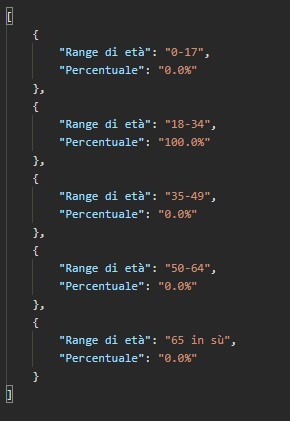


## Filtri

I filtri definiti sono i seguenti:

| Tipo          | Categoria | Parametri Filtro | Descrizione                                     |
| ------------- | :-------- | ---------------- | :---------------------------------------------- |
| `Utente`      | `Eta`     | etaMin, etaMax   | *Filtra in base al range di età scelto.*        |
| `Utente`      | `Genere`  | gen              | *Filtra in base al genere: **M**, **F**.*       |
| `Utente`      | `Tipo`    | tipo             | *Filtra in base al livello di attività fisica.* |
| `Misurazioni` | `Peso`    | pesoMin, pesoMax | *Filtra in base al range di peso scelto .*      |
| `Misurazioni` | `Bmi`     | bmiMin, bmiMax   | *Filtra in base al range di Bmi scelto .*       |
| `Misurazioni` | `Lbm`     | lbmMin, lbmMax   | *Filtra in base al range di Lbm scelto .*       |
| `Misurazioni` | `Data`    | dal, al          | *Filtra in base al range di date scelte .*      |


Esempio di rotta `/stats` di tipo POST :

*Body:*

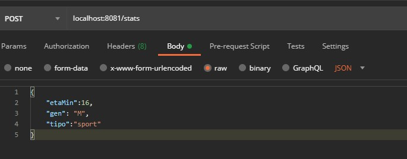


## Diagrammi UML

### **Diagramma dei casi d'uso:**


### **Diagrammi delle classi:**

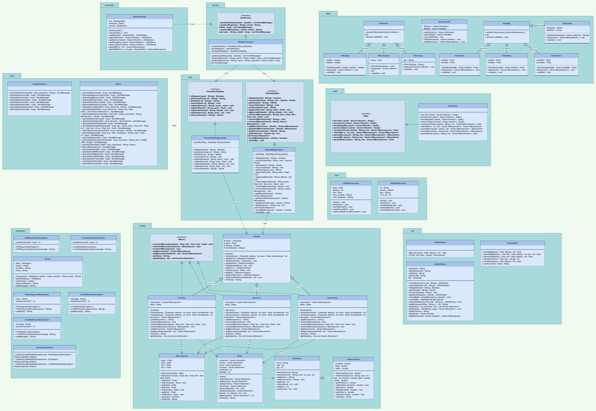


- **Package controller:**

  
  
  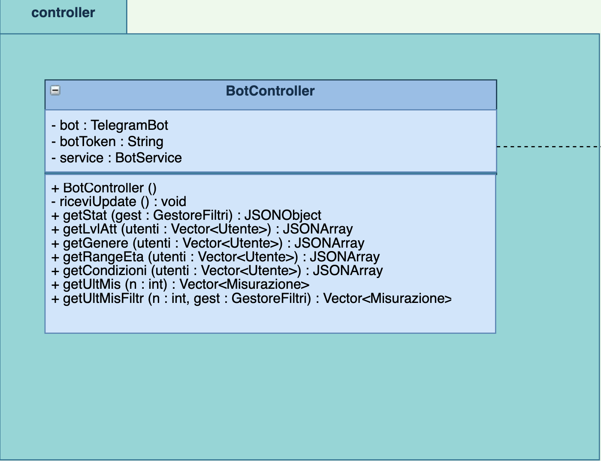


- **Package service:**

  
  
  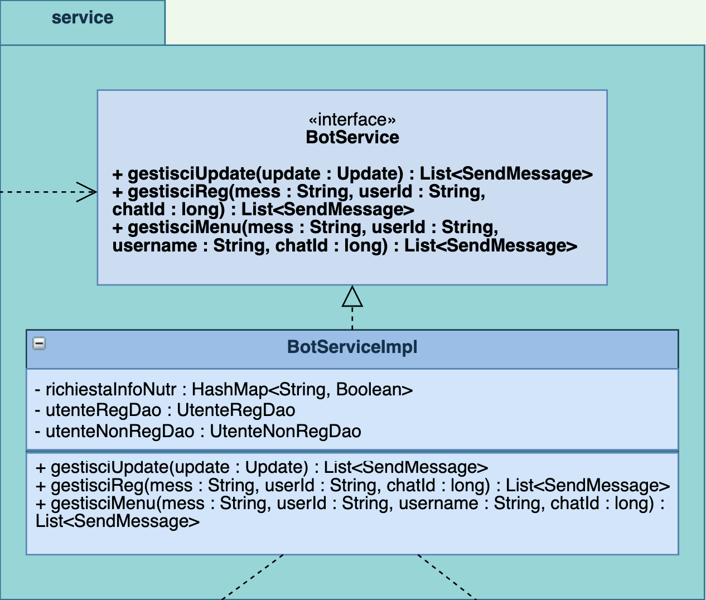


- **Package filter:**

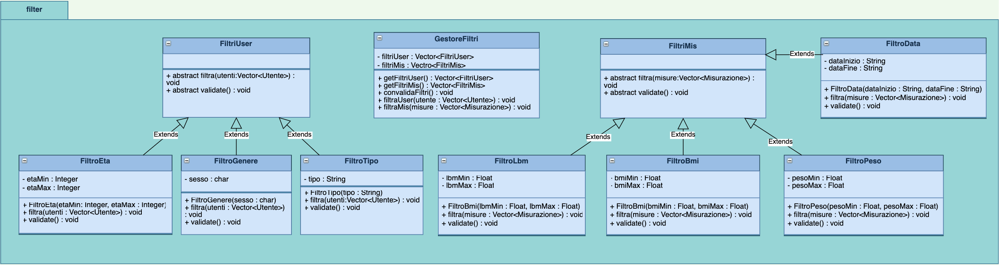


- **Package view:**

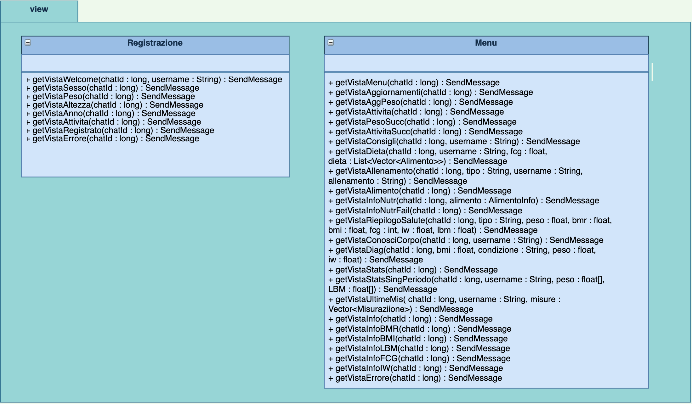


- **Package dao:**

 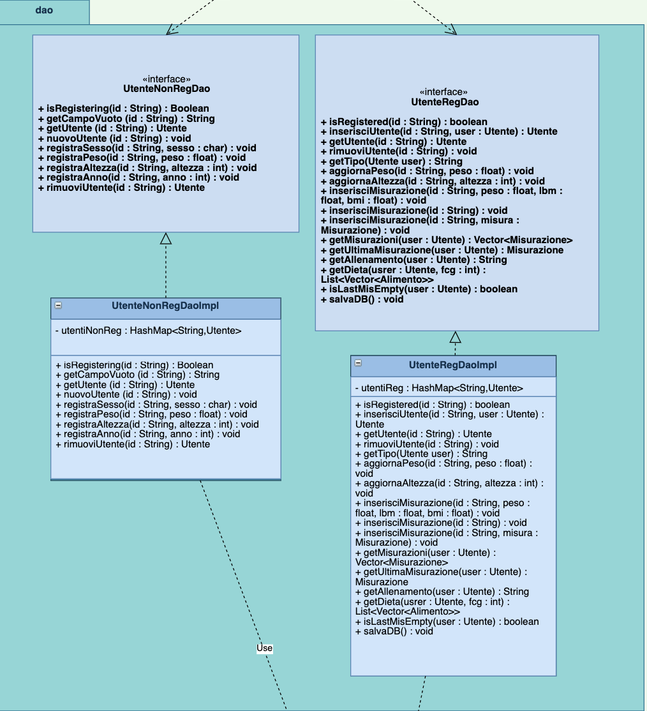


- **Package stats:**

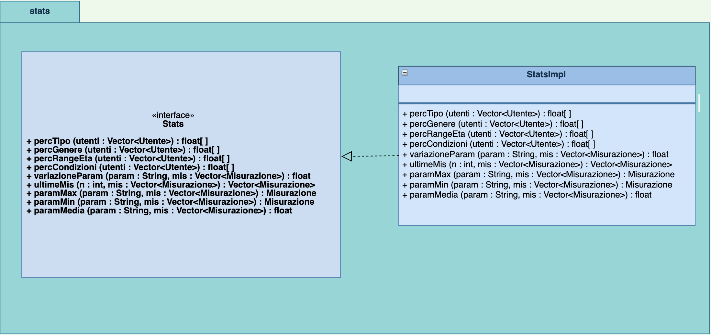


- **Package test:**

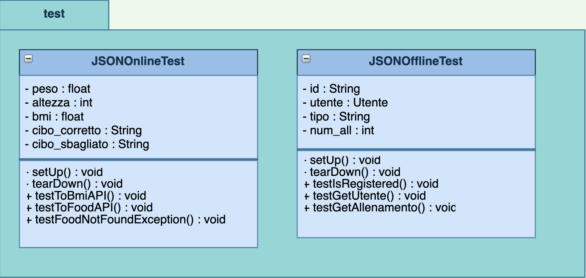


- **Package exception:**

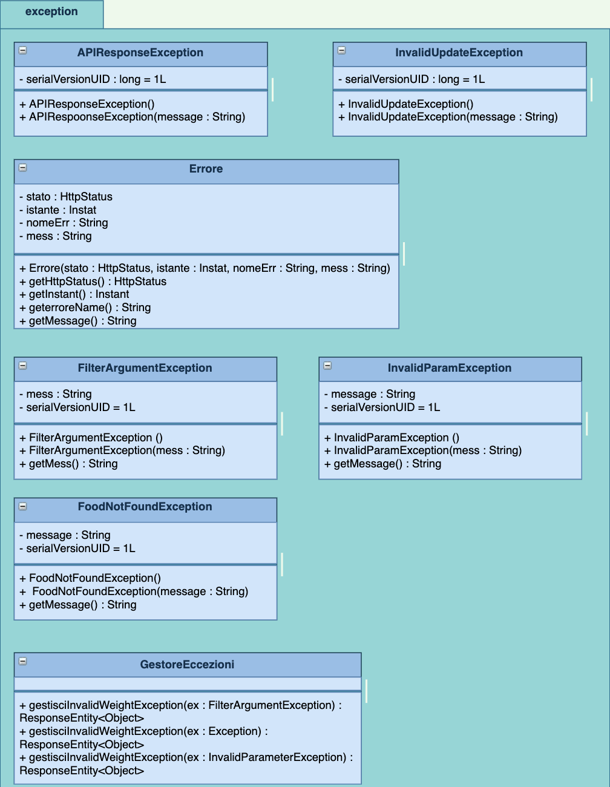


- **Package model:**

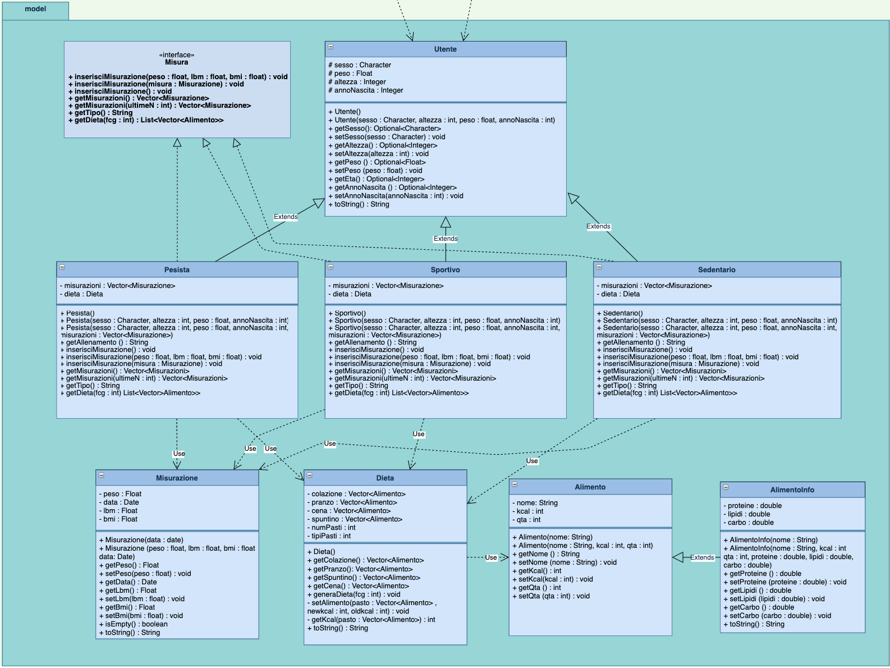


- **Package util:**

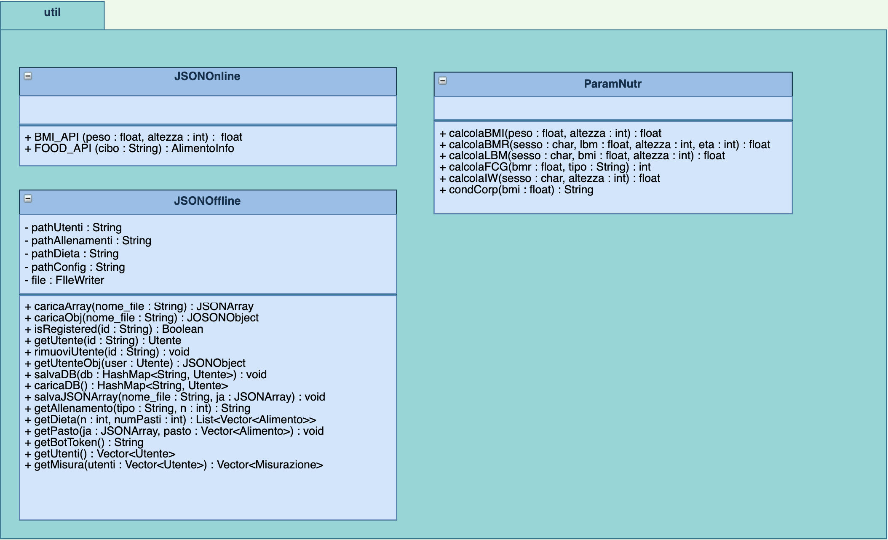


### **Diagrammi delle sequenze:**

- **Meccanismo di richiesta degli updates ed elaborazione degli stessi**

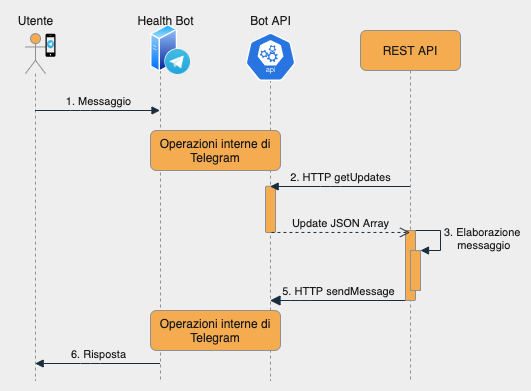


- **Registrazione di un nuovo utente**

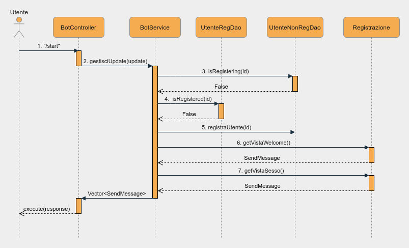


- **Chiamata alla Food API**

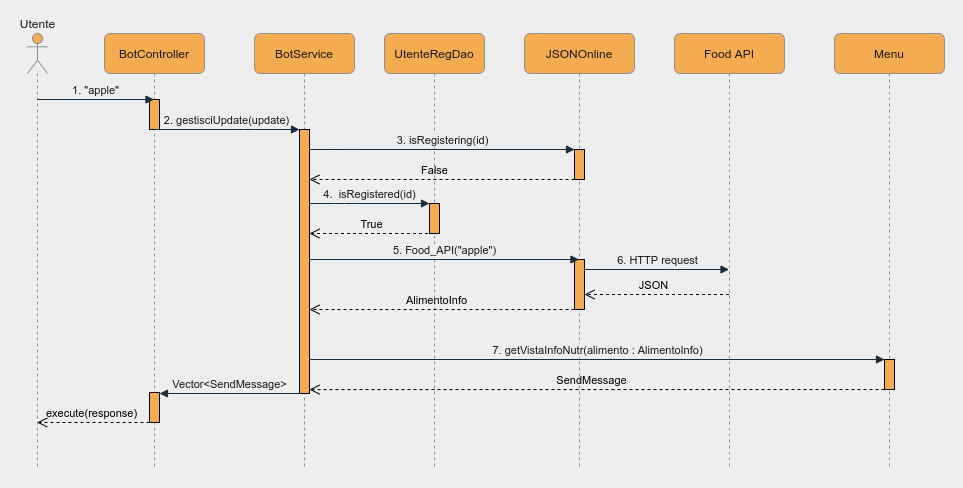


- **Esempio di rotta POST "/stats"**

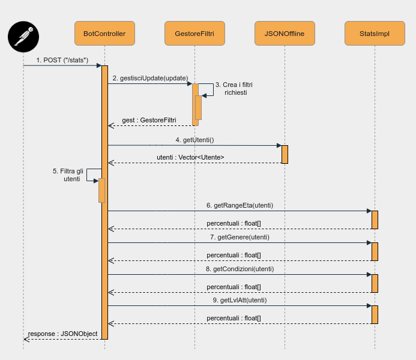

## Tecnologie utilizzate

- Software utilizzati:

  [Eclipse](https://www.eclipse.org/downloads/) - IDE per scrivere il codice in Java 

  [SpringBoot](https://spring.io/projects/spring-boot) - framework backend Java

  [PostMan](https://www.postman.com) - Software per l'API Testing

  [UMLGenerator](http://www.umldesigner.org) - utilizzato per il diagramma dei casi d'uso

  [Draw.io](https://app.diagrams.net) - utilizzato per il diagramma delle classi e delle sequenze

  [Typora](https://typora.io) - usato per scrivere il ReadMe.md in formato Markdown

- Telegram BOT API:

  [Telegram](https://core.telegram.org/bots/api) - Documentazione API telegram 

- Implentazione per Java (librerie utilizzate):

  [Libreria Pengrad](https://github.com/pengrad/java-telegram-bot-api)

- REST API esterne:

  [CalorieNinjas](https://rapidapi.com/calorieninjas/api/calorieninjas/endpoints) - API che restituisce le info nutrizionali su di un alimento

  [BMICalculator](https://rapidapi.com/SharkAPIs/api/body-mass-index-bmi-calculator/) - API che calcola automaticamente il BMI di un individuo

## Autori

- [Federico Palazzi](https://github.com/fedePalazz) 
- [Giovanni Novelli](https://github.com/GiovanniNovelli9) 
- [Alessio Baldelli](https://github.com/Baldellaux]) 

