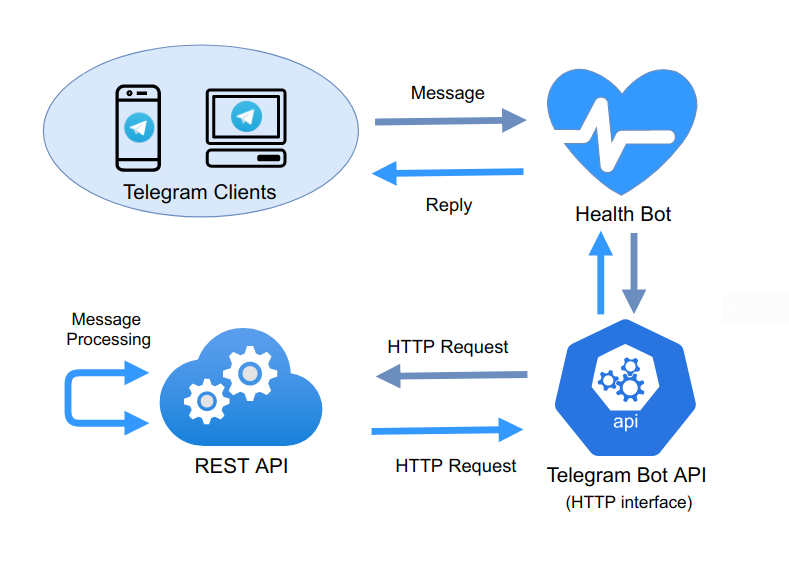
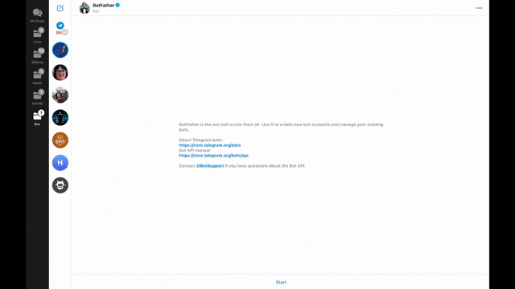
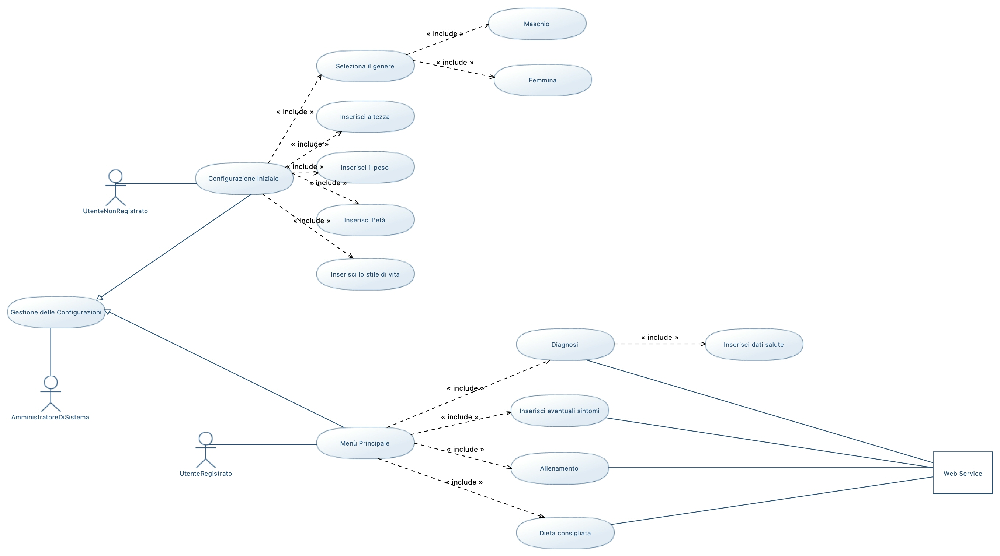

# Progetto Programmazione ad Oggetti: Health_Bot

<<<<<<< HEAD
## INTRODUZIONE

Lo scopo del progetto è quello di realizzare un Web Service in grado di interagire con le API di Telegram e permettere il funzionamento di "Health_Bot", un bot con svariate funzionalità:

- Monitoraggio del peso e del BMI

- Calcolo del FCG (Fabbisogno Calorico Giornaliero), del PI (Peso ideale) e dell'LBM (Massa magra in kg)

- Diagnostica della salute (sulla base del BMI)

- Statistiche su peso e BMI (sia personali per ogni utente, che generali accessibili tramite richieste GET)

  

## LOGICA DI FUNZIONAMENTO

=======
Lo scopo del progetto è quello di realizzare un Web Service in grado di interagire con le API di Telegram e permettere il funzionamento di "Health_Bot", un bot con svariate funzionalità:
- Monitoraggio del peso e del BMI
- Calcolo del FCG (Fabbisogno Calorico Giornaliero), del PI (Peso ideale) e dell'LBM (Massa magra in kg)
- Diagnostica della salute (sulla base del BMI)
- Statistiche su peso e BMI (sia personali per ogni utente, che generali accessibili tramite richieste GET)
>>>>>>> 364d5be3cc53c88560b2cdc380f0d7a40b43a962

## LOGICA DI FUNZIONAMENTO

## GETTING STARTED

Per poter iniziare è necessario creare un bot su Telegram interagendo direttamente con il BotFather, come mostrato nella gif sotto:

Successivamente, seguendo le istruzioni indicate da BotFather, sarà possibile, per esempio:

- Scegliere un username per il bot (deve terminare per forza con 'Bot' o 'bot')

- Abilitare/disabilitare il bot ad essere inserito in gruppi

- Scegliere la descrizione tramite il comando '/setdescription'.

Inoltre BotFather fornisce all'utente il token da utilizzare per comandare il bot tramite richieste HTTP.

## DIAGRAMMI UML E FUNZIONAMENTO DEL SOFTWARE

Diagramma dei casi d'uso:

Diagrammi delle classi:

Diagrammi delle sequenze:

## TECNOLOGIE UTILIZZATE
<<<<<<< HEAD

- Eclipse (IDE)
- Spring Boot (Framework backend Java)
- Telegram BOT API (Documentazione)

=======
- Eclipse (IDE)
- Spring Boot (Framework backend Java)
- Telegram BOT API (Documentazione)
>>>>>>> 364d5be3cc53c88560b2cdc380f0d7a40b43a962

## Contributors

- Federico Palazzi [https://github.com/fedePalazz]
- Giovanni Novelli [https://github.com/GiovanniNovelli9] 
- Alessio Baldelli [https://github.com/Baldellaux]

