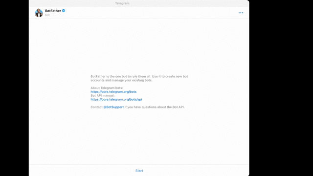
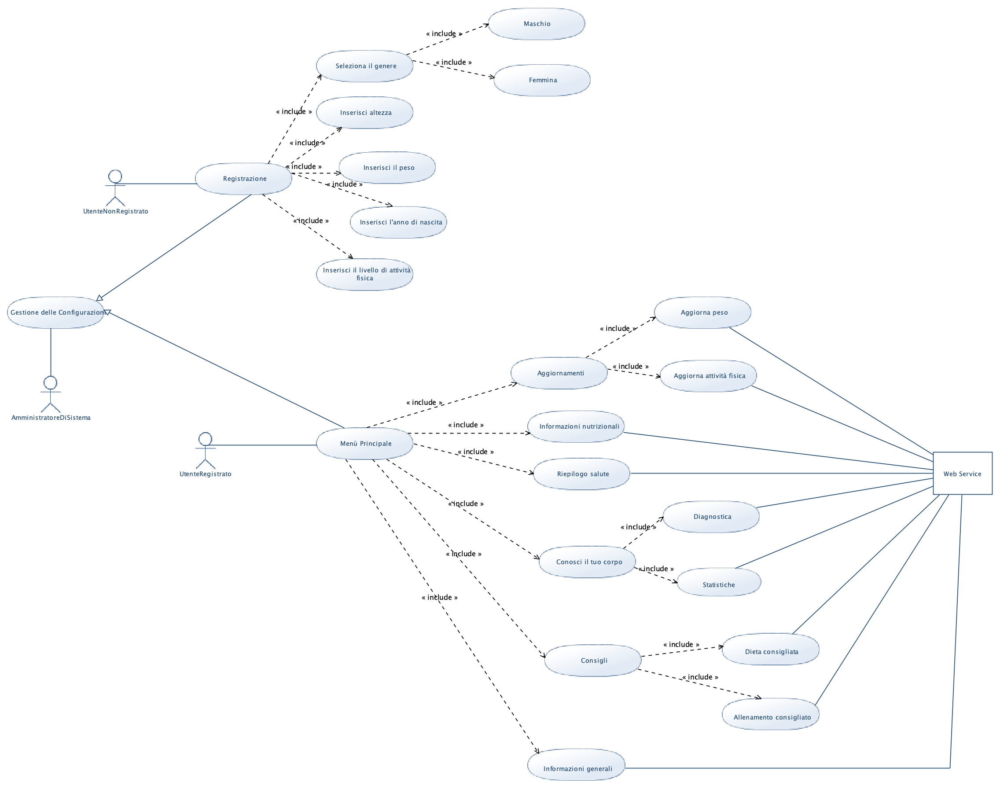

# Progetto Programmazione ad Oggetti: Health_Bot

## INTRODUZIONE

Lo scopo del progetto è quello di realizzare un Web Service in grado di interagire con l' API di Telegram e permettere il funzionamento di "Health_Bot", un bot con svariate funzionalità, tra cui:

- Monitoraggio del peso e del BMI;

- Calcolo del FCG (Fabbisogno Calorico Giornaliero), del PI (Peso ideale), del BMR (Fabbisogno Metabolico a Riposo) e dell'LBM (Massa magra in kg);

- Diagnostica della salute (sulla base del BMI);

- Consigli sull'allenamento, in base al livello di attività fisica svolta dall'utente, e sulla dieta, in base al valore del suo FCG;

- Statistiche su peso e BMI (sia personali per ogni utente, che generali accessibili tramite richieste GET).

  

## LOGICA DI FUNZIONAMENTO

## GETTING STARTED

Per poter iniziare è necessario creare un bot su Telegram interagendo direttamente con il BotFather, come mostrato nella gif sotto:

Successivamente, seguendo le istruzioni indicate da BotFather, sarà possibile, per esempio:

- Scegliere un username per il bot (deve terminare con 'Bot' o 'bot');

- Abilitare/disabilitare il bot ad essere inserito in gruppi;

- Scegliere la descrizione tramite il comando '/setdescription'.

Inoltre BotFather fornisce all'utente il token da utilizzare per comandare il bot tramite richieste HTTP.

## DIAGRAMMI UML E FUNZIONAMENTO DEL SOFTWARE

Diagramma dei casi d'uso:

Diagrammi delle classi:

Diagrammi delle sequenze:

## TECNOLOGIE UTILIZZATE

- Software utilizzati:

  [Eclipse](https://www.eclipse.org/downloads/) -IDE per scrivere il codice in Java 

  [SpringBoot](https://spring.io/projects/spring-boot) -framework per sviluppo di applicazioni Java

  [PostMan](https://www.postman.com) -Software per l'API Testing

  [UMLGenerator](http://www.umldesigner.org) -utilizzato per il diagramma dei casi d'uso

  [Draw.io](https://app.diagrams.net) -utilizzato per il diagramma delle classi e delle sequenze

  [Typora](https://typora.io) -usato per scrivere il ReadMe.md in formato Markdown

- Telegram BOT API:

  [Telegram](https://core.telegram.org/bots/api) -Documentazione API telegram 

  

- Implentazione per Java (librerie utilizzate):

  [Libreria Pengrad](https://github.com/pengrad/java-telegram-bot-api)

- REST API esterne:

  [CalorieNinjas](https://rapidapi.com/calorieninjas/api/calorieninjas/endpoints) -API che restituisce le info nutrizionali su di un alimento

  [BMICalculator](https://rapidapi.com/SharkAPIs/api/body-mass-index-bmi-calculator/) -API che calcola automaticamente il BMI di un individuo

  

## Contributors

- [Federico Palazzi](https://github.com/fedePalazz) 
- [Giovanni Novelli](https://github.com/GiovanniNovelli9) 
- [Alessio Baldelli](https://github.com/Baldellaux]) 

