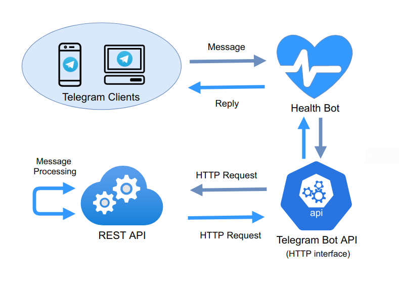
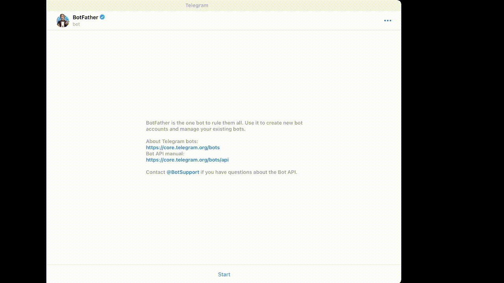
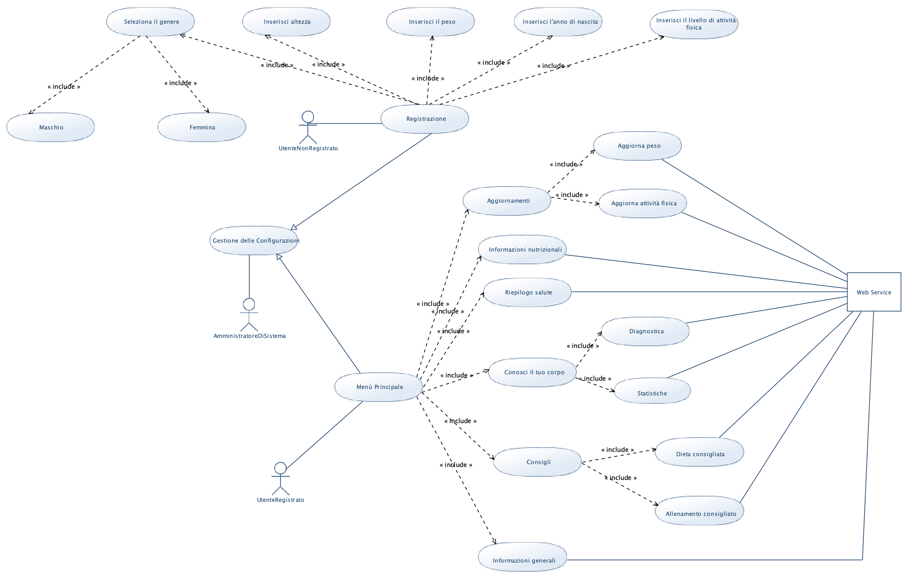
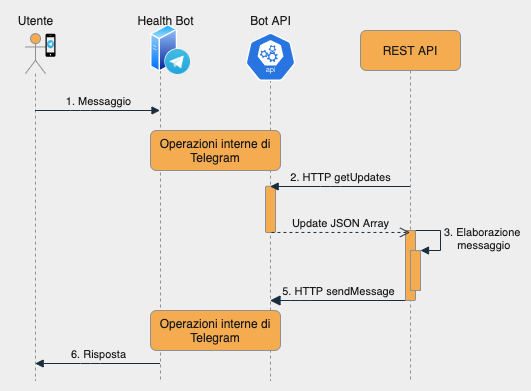

#           Progetto Programmazione ad Oggetti: Health_Bot

TODO Indice

## Introduzione

Lo scopo del progetto è quello di realizzare un Web Service in grado di interagire con l' API di Telegram e permettere il funzionamento di "Health_Bot", un bot con svariate funzionalità, tra cui:

- Aggiornamento parametri: peso e livello di attività fisica;

- Calcolo del BMI (Body Mass Index), del FCG (Fabbisogno Calorico Giornaliero), del PI (Peso ideale), del BMR (Fabbisogno Metabolico a Riposo) e dell'LBM (Massa magra in kg);

- Diagnostica della salute, sulla base del BMI e del PI;

- Calcolo dei principali valori nutrizionali di un alimento;

- Consigli sull'allenamento, in base al livello di attività fisica svolta dall'utente, e sulla dieta, in base al valore del suo FCG;

- Statistiche su peso, BMI ed LBM (sia personali per ogni utente, che generali accessibili tramite richieste GET).

  

## Logica di funzionamento

Il telegram client, cioè un normale utente dell'app telegram, manda un messaggio alla chat @health_fit_bot (https://t.me/health_fit_bot), che risponde con una delle viste programmate. L'interfaccia del bot è a sua volta controllata dal web service (il software qui sviluppato) che comunica direttamente con la Telegramm Bot API attraverso richieste formattatate in HTTP. Quest'ultima, in base alla richiesta dell'utente, nel caso di Health_Bot, per esempio, questa funzione si attiva nel bottone "Info nutrizionali", si può inoltre mettere in comunicazione attraverso una richiesta HTTP con una REST API esterna.

## Configurazione iniziale

Per poter iniziare è necessario creare un bot su Telegram interagendo direttamente con il BotFather, come mostrato nella gif sotto:

Successivamente, seguendo le istruzioni indicate da BotFather, sarà possibile, per esempio:

- Scegliere un username per il bot (deve terminare con 'Bot' o 'bot');

- Abilitare/disabilitare il bot ad essere inserito in gruppi;

- Scegliere la descrizione tramite il comando '/setdescription'.

Inoltre BotFather fornisce all'utente il token da utilizzare per comandare il bot tramite richieste HTTP.

## Anteprima: funzionamento nell'app mobile Telegram

### Registrazione dell'utente

### Menù parte 1:

### Menù parte 2:

## Download

Attraverso l’ambiente Eclipse si possono eseguire le seguenti operazioni:

• Clonare la repository dal workspace di Github;

• Eseguire il codice come SpringBoot application;

• Aprire un API testing, come ad esempio [PostMan](https://www.postman.com).

L’applicazione ora è pronta ed è in ascolto alla porta http://localhost8081.

## Rotte

Le rotte definite sono le seguenti:

| Tipo  | Rotta                          | Descrizione                                                  |
| ----- | :----------------------------- | :----------------------------------------------------------- |
| `GET` | `/tipo?tipo=param`             | *Parametri consentiti: **sed** = sedentari, **sport** = sportivi, **pes** = pesisti. Restituisce un JSONObject contenente la singola percentuale di utenti per ogni livello di attività fisica scelto.* |
| `GET` | `/genere?genere=param`         | *Parametri consentiti: **M**, **F**.                                                                         Restituisce un JSONObject contenente la singola percentuale di utenti per genere.* |
| `GET` | `/rangeEta?eta=anni`           | *Restituisce un JSONObject contenente la singola percentuale relativa al range dell'età scelta.* |
| `GET` | `/condizioni?condizioni=param` | *Parametri consentiti: **magro** = Grave Magrezza, **sott** = Sottopeso, **norm** = Normopeso, **sovr** = Sovrappeso, **ob1** = Obesità Classe I (lieve), **ob2** = Obesità Classe II (media), **ob3** = Obesità Classe III (grave).                                                                      Restituisce un JSONObject contenente la singola percentuale relativa alla condizione fisica scelta.* |
| `GET` | `/ultMis?lastMis=n`            | *Restituisce un JSONObject contenente le ultime **n** misurazioni scelte dall'utente.* |
|       |                                |                                                              |
|       |                                |                                                              |

## Diagrammi UML

Diagramma dei casi d'uso:

Diagrammi delle classi:

Diagrammi delle sequenze:

## Tecnologie utilizzate

- Software utilizzati:

  [Eclipse](https://www.eclipse.org/downloads/) -IDE per scrivere il codice in Java 

  [SpringBoot](https://spring.io/projects/spring-boot) -framework per sviluppo di applicazioni Java

  [PostMan](https://www.postman.com) -Software per l'API Testing

  [UMLGenerator](http://www.umldesigner.org) -utilizzato per il diagramma dei casi d'uso

  [Draw.io](https://app.diagrams.net) -utilizzato per il diagramma delle classi e delle sequenze

  [Typora](https://typora.io) -usato per scrivere il ReadMe.md in formato Markdown

- Telegram BOT API:

  [Telegram](https://core.telegram.org/bots/api) -Documentazione API telegram 

  

- Implentazione per Java (librerie utilizzate):

  [Libreria Pengrad](https://github.com/pengrad/java-telegram-bot-api)

- REST API esterne:

  [CalorieNinjas](https://rapidapi.com/calorieninjas/api/calorieninjas/endpoints) -API che restituisce le info nutrizionali su di un alimento

  [BMICalculator](https://rapidapi.com/SharkAPIs/api/body-mass-index-bmi-calculator/) -API che calcola automaticamente il BMI di un individuo

  

## Autori

- [Federico Palazzi](https://github.com/fedePalazz) 
- [Giovanni Novelli](https://github.com/GiovanniNovelli9) 
- [Alessio Baldelli](https://github.com/Baldellaux]) 

